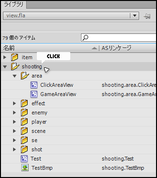

Flash-To-Haxe-Converter
=======================
licence: MIT

Flash-To-Haxe-Converter は、Flash CS 内構造を Haxe extern クラスに出力する JSFL です。出力されるクラス群は、Haxe での Flash コンテンツや html5 コンテンツ開発に有用できます。

##制作の流れと Flash-To-Haxe-Converter の役割箇所

Flash CS と Haxe を利用することで、Flash コンテンツ, html5 canvas コンテンツ, Desktop アプリケーション, Android アプリ, iOS アプリ といった様々なプラットフォーム向けのコンテンツ並行制作が可能となります。制作の流れは以下の図のようになります。

まず、Photoshop や Illustrator を用いて画像素材を作成し、また、サウンド編集ソフトで音声ファイルを作成後、Flash CS に取り込みます。

Flash CS では、各素材を利用してアニメーションを作成したり、各素材データをスクリプトから操作できるよう 素材に命名(リンケージ設定)を行います。編集作業完了後、Flash コンテンツを制作する場合は swf をパブリッシュ、html5 コンテンツを制作する場合は Toolkit for CreateJS でのパブリッシュを行います。

同時に当 JSFL(図内 Flash To Haxe Converter) を利用して、Flash CS 内ライブラリ構造を Haxe extern クラス群に変換を行います。

出力された Flash & html5 用のデータは共通の構造を持つため、クロスプラットフォーム用言語 Haxe にて処理することにより、より少ない手間で Flash コンテンツや html5 canvas コンテンツの同時制作が可能となります。

更に、Flash コンテンツ用 swf に多少の処理を付け加えることで、そのまま Adobe AIR に変換する事もできます。(Adobe AIR 専用の機能を利用する場合は図内「Flash(swf)」の他 Adobe AIR 用の swf 出力が必要となります。)

TFCLib は Toolkit for CreateJS のパブリッシュデータをスクリプト(javascript or Haxe)から利用しやすくするためのもので、別途制作しているライブラリです。当アプリケーションで出力される 図内 CreateJS-Haxe クラス群は無くても利用できますが、利用すると更に効率よく開発を進めることが可能となります。

* 参考 TFCLib その他を配置している haxe 用ライブラリ

	[https://github.com/siratama/haxelib](https://github.com/siratama/haxelib)

##JSFL 本体

以下のファイルが、本体となる JSFL ファイルです。

	jsfl/FlashToHaxe.jsfl

この JSFL は Haxe を用いて作成しており、内容は少々見難いものとなっています。JSFL を作成した Haxe のソースコードは src/ ディレクトリ内に配置しています。

##利用手順

JSFL 利用例は exapmples/ ディレクトリ内に配置しています。examples/1/ ディレクトリ内ファイルを例に利用手順を記述します。

###JSFL 本体の配置

jsfl/FlashToHaxe.jsfl をコピーして任意のディレクトリに配置します。コピーせずサンプルそのままの位置でも問題ありません。

###FlashToHaxe.jsfl を起動する jsfl の作成

FlashToHaxe.jsfl を起動する任意の名前の jsfl を作成します。サンプルでは examples/1/jsfl/FlashToHaxePublisher.jsfl を用意しています。

FlashToHaxePublisher.jsfl 内には例えば以下のような変数値設定を行います。

    var JSFL_MAIN_URI = "H:/eclipse/workspace/FlashToHaxeConverter/trunk/jsfl/FlashToHaxe.jsfl";
    var FLA_FILE_URI = "H:/eclipse/workspace/FlashToHaxeConverter/trunk/examples/1/fla/view.fla";
    var PUBLISH_DIRECTORY = "H:/eclipse/workspace/FlashToHaxeConverter/trunk/examples/1/src/";
    var FLASH_HAXE_DIRECTORY = "swf_as3/";
    var CREATEJS_HAXE_DIRECTORY = "swf_haxe/";
    var SYMBOL_NAMESPACE = "lib";

ディレクトリは当 JSFL 製作者のものとなっているため、任意に書き換えてください。

* JSFL\_MAIN\_URI: FlashToHaxe.jsfl の絶対パス
* FLA\_FILE\_URI: パブリッシュ対象 fla ファイルの絶対パス
* PUBLISH_DIRECTORY: Haxe ファイルを出力する基礎ディレクトリ絶対パス
* FLASH_HAXE_DIRECTORY: Flash-Haxe 用 クラスファイル群を出力するディレクトリ
* CREATEJS_HAXE_DIRECTORY: CreateJS-Haxe 用 クラスファイル群を出力するディレクトリ
* SYMBOL_NAMESPACE: Toolkit for CreateJS 設定ウインドウで設定した JS名前空間(シンボル)

上記例の場合、出力先 Haxe ファイル・ディレクトリは以下となります。

* H:/eclipse/workspace/FlashToHaxeConverter/trunk/examples/1/src/swf_as3/
* H:/eclipse/workspace/FlashToHaxeConverter/trunk/examples/1/src/swf_haxe/

また FlashToHaxePublisher.jsfl 内最下部に以下の行をコメントアウトしています。

    //publish swf
    //fl.publishDocument(PRE_URI + FLA_FILE_URI);

    //publish Toolkit for CreateJS
    //fl.runScript(PRE_URI + "C:/Users/username/AppData/Local/Adobe/Flash CS6/ja_JP/Configuration/CreateJS/jsfl/Publish for CreateJS.jsfl");

fl.～ と記述している行のコメントアウトを外すことで、FlashToHaxePublisher.jsfl ファイル実行と同時に swf と Toolkit for CreateJS のパブリッシュも同時に行われるようになります。Publish for CreateJS.jsfl のファイルパスは環境によって異なるため、任意の値に変更してください。上記は Windows 用のユーザ名が username だった場合のパスとなります。

その他オプション機能としまして、Flash API 用 Haxe extern クラスファイル出力が不要な場合は、Main コンストラクタ呼び出し箇所の第二パラメータを空文字指定にします。

    new Main(
    	PRE_URI + FLA_FILE_URI,
    	"",
    	PRE_URI + PUBLISH_DIRECTORY + CREATEJS_HAXE_DIRECTORY,
    	SYMBOL_NAMESPACE
    );

Main クラスコンストラクタ 第5引数に true を指定すると、hx ファイル出力前に 出力対象ディレクトリの初期化(削除 & 作成)が行われます。これにより、不要になった hx ファイルが出力ディレクトリ内に残る事は無くなります。

    new Main(
    	PRE_URI + FLA_FILE_URI,
    	PRE_URI + PUBLISH_DIRECTORY + FLASH_HAXE_DIRECTORY,
    	PRE_URI + PUBLISH_DIRECTORY + CREATEJS_HAXE_DIRECTORY,
    	SYMBOL_NAMESPACE,
		true
    );

ディレクトリ初期化が正常に行われないと Flash CS 出力ウインドウに error が表示されます。hx 出力対象ディレクトリを開いていたりするとエラーが発生します。全てのフォルダを閉じる等して、再度 jsfl を実行してください。

###JSFL 実行

FlashToHaxePublisher.jsfl をダブルクリック、あるいは Flash CS 上にドラッグ＆ドロップで JSFL を実行できます。

実行後、FlashToHaxePublisher.jsfl 内で設定した fla ファイルをまだ開いていない場合、Flash CS が起動して fla ファイルが開かれます。fla ファイルが開いただけの状態では jsfl コマンドは全て実行されず、「Select item in library.」というメッセージが表示されます。

続きを実行させるには、ライブラリ内の出力対象となるパッケージフォルダをクリックして ハイライト状態にし、その後再度 FlashToHaxePublisher.jsfl を実行してください。

###出力された Haxe クラスの利用

当アプリケーションで出力したクラスの利用例は、 examples/1/src/main/ ディレクトリ内の各 Haxe ファイルをご確認ください。

Haxe 処理からコンパイルされた各ファイルは、あらかじめ examples/1/deploy/ ディレクトリ内に出力しています。Flash 用コンテンツとしては preloader.swf と main.swf、html5 用コンテンツとしては js/App.js を出力しています。

###dango-itimi haxelib のダウンロード

examples/1/src/main/ ディクレクトリ内 各 Haxe クラスファイルからは Toolkit for CreateJS パブリッシュデータを扱いやすくするための Haxe ライブラリ「TFCLib」や、Flash-Haxe 用ファイル読み込み処理ライブラリを利用しています。必要があれば以下の URL にあるファイルをダウンロードしてクラスパス設定を行なってください。

* dango-itimi haxelib

	[https://github.com/siratama/haxelib](https://github.com/siratama/haxelib)

* dango-itimi haxelib ダウンロードページ

	[https://github.com/siratama/haxelib/tags](https://github.com/siratama/haxelib/tags)

ダウンロード後、haxelib/src/ ディレクトリ内 as3/, core/, createjs/, toolkit\_for\_createjs/ ディレクトリにクラスパスを通します。

##サンプル解説

* examples/1/

	Haxe 条件付きコンパイル指定を行い、一つのソースコード内に Flash 用ソースコードと javascript 用ソースコード両方を記述した例

* examples/2/

	プラットフォームごとに、一つのソースコード内に Flash 用ソースコードと javascript 用ソースコード両方を記述した例

examples/2/air/ ディレクトリ内には Adobe AIR (Android アプリ)を出力するサンプルも作成しています。Haxe からコンパイルされた Flash コンテンツ用 main.swf を読み込む処理を Action Script 3.0 で AirSample.as に記述し、air\_sample.fla ファイルのドキュメントクラスとして AirSample.as を設定後、air\_sample.fla から AIR の出力を行なっています。

##注意点

###haxelib jsfl

jsfl を作成した Haxe ソースコードでは、以下の jsfl 用 extern ライブラリを利用しています。

[http://lib.haxe.org/p/jsfl](http://lib.haxe.org/p/jsfl)

しかし、上記の物は対象となる jsfl のバージョンが古く、少々内容を変更する必要があります。Haxe ソースコードを修正する場合は少々手間となるためご注意ください。

###対応バージョン

当アプリケーションは以下のバージョンをターゲットにしています。

* Toolkit for CreateJS 1.2
* Haxe 2.10

