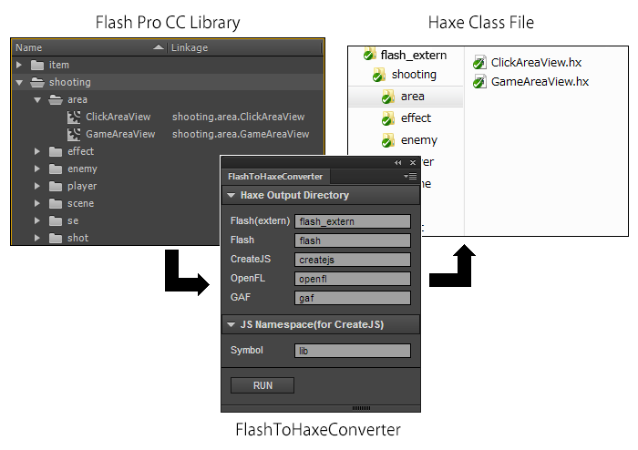
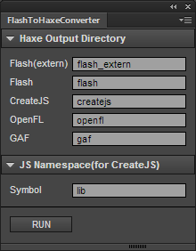
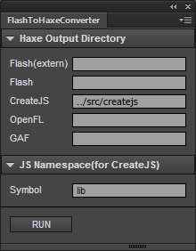

FlashToHaxeConverter
=======================
Document Language [English] | [[Japanese]](README_jp.md)

FlashToHaxeConverter is extension panel outputting structure in Flash CC to the Haxe class.
FlashToHaxeConverter outputs for Flash contents and Toolkit for CreateJS (html5 canvas) contents and OpenFL and GAF.

You can create an output Haxe Class using new syntax.

	var gameAreaView = new GameAreaView();
	addChild(gameAreaView);

The access to Nesting MovieClip is also easy.

	var playerPositionX = gameAreaView.playerArea.player.x;

---
## Download (Flash Pro CC)

* [FlashToHaxeConverter.zxp](https://raw.github.com/siratama/Flash-To-Haxe-Converter/master/download/FlashToHaxeConverter.zxp)

This can be used by Flash Pro CC. In the case of Windows, it can save from a right-click. 
[Extension Manager Command Line tool(ExManCmd)](https://www.adobeexchange.com/resources/28) is required in order to install. 

---
## Download (Etc)

* [Linkage](https://github.com/siratama/Linkage)

This is a extension panel for linkage setting. Please use together with FlashToHaxeConverter.

---
## Usage

The linkaged symbol in the library is output as Haxe file when you push RUN button.

It is not output when you empty a text field. In the case of the following figures, only file group of CreateJS-Haxe is output. 

When you want to output it in any directory, you describe relative path.

---
## FAQ

### Difference with output file Flash(extern) and Flash

#### Flash(extern)

* Using the compile option -swf-lib of Haxe, when embedding assets swf at swf outputed from Haxe, it uses. 

#### Flash

* It uses, when loading assets swf from the exterior using Loader class. 

---
## Features

### The original output for html5 canvas

The following property is added to the CreateJS-Haxe. 
You can access the javascript file output by this from html5 canvas document easily.

* Sound.manifestId 
* Bitmap.manifestId 
* Bitmap.nominalBounds
* Container.nominalBounds
* MovieClip.nominalBounds

---
## .hx file deletion

When the structure of a library is changed, a former unnecessary file will remain in a Haxe output directory. 
Please delete a Haxe output directory manually to delete an unnecessary file.

---
## Restrictions
### OpenFL-Haxe or GAF-Haxe

Use of an output OpenFL-Haxe or GAF-Haxe file is subject to restrictions.

View(MovieClip) needs a cast to use a property of MovieClip for a abstract class.

	var view = new View();
	addChild(view); //ok
	trace(view.x); //error
	var mc:MovieClip = cast view;
	trace(mc.x); //ok

It can't be created in Type.createInstance method. 

	var view = Type.createInstance(View, []);
	addChild(view); //error

But it can be created by the next code.

	var view = Type.createInstance(View, [])._new();
	addChild(view); //ok

When doing a cross-platform programming, use the next class.

[TypeUtil.hx](https://gist.github.com/siratama/4f46732f912ec031d8d1)

### OpenFL-Haxe

A sound file is written in a project.xml for compilation manually.

	<assets path="test/JumpSound.wav" id="test.JumpSound" />

The next cord is written in OpenFL-Haxe Sound Class. Create in new JumpSound().

	public function new()
		this = Assets.getSound('test.JumpSound');

---
## examples

* [Flash](examples/flash/)
* [CreateJS](examples/createjs/)
* [OpenFL](https://github.com/siratama/FlashAndCppOutputUsingSwfFromOpenFL)
* [GAF](https://github.com/siratama/HaxeSampleUsingGAF)

---
## External library

* [CreateJS extern](https://github.com/nickalie/CreateJS-Haxe)
---
## Library for extension development

* [haxe-jsfl](https://github.com/tmskst/haxe-jsfl)

