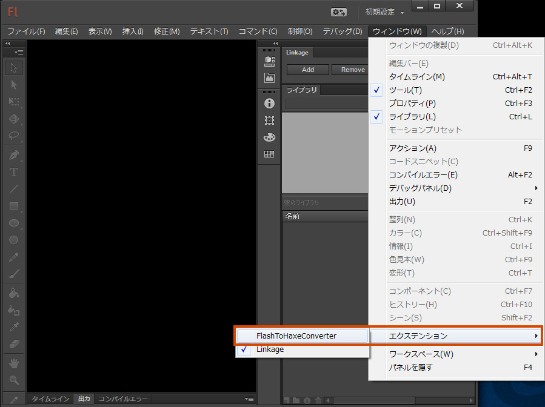
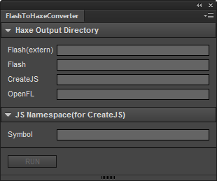
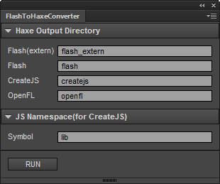
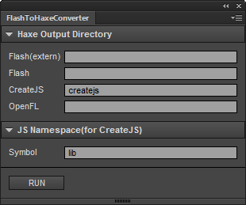
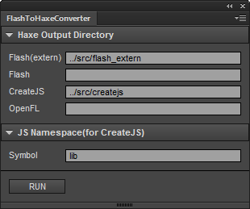
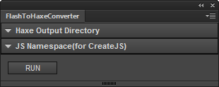

FlashToHaxeConverter
=======================
licence: MIT

FlashToHaxeConverter is JSFL outputting structure in Flash CC to the Haxe class.  FlashToHaxeConverter outputs for Flash contents and Toolkit for CreateJS (html5 canvas) contents and OpenFL.

FlashToHaxeConverter は、Flash CC 内構造を Haxe クラスに出力する JSFL です。Flash コンテンツ用(二種類)、Toolkit for CreateJS (html5 canvas コンテンツ)用、OpenFL 用の合計四種類の出力が可能です。

---
## Download (Flash Pro CC 13.1 or later)

* [FlashToHaxeConverter.zxp](https://raw.github.com/siratama/Flash-To-Haxe-Converter/master/download/FlashToHaxeConverter.zxp)

This can be used by Flash CC 13.1 or later. In the case of Windows, it can save from a right-click. [Adobe Extension Manager CC(Free)](http://www.adobe.com/exchange/em_download/) is required in order to install. 

Flash CC 13.1 以降のバージョンで利用可能です。Windows の場合、右クリックから「リンク先のコンテンツを保存」を選択で保存できます。インストールには別途 [Adobe Extension Manager CC(無料)](http://www.adobe.com/jp/exchange/em_download/)が必要です。

## Installation

After installation of Adobe Extension Manager CC, if FlashToHaxeConverter.zxp is double-clicked, installation of FlashToHaxeConverter will begin. If Flash CC is rebooted after the completion of installation, FlashToHaxeConverter will be displayed on the item of extension in window menu. 

Adobe Extension Manager CC インストール後、FlashToHaxeConverter.zxp をダブルクリックする事で、FlashToHaxeConverter インストール作業が行われます。インストール完了後 Flash CC を再起動し、メニュー「ウインドウ」->「エクステンション」内に「FlashToHaxeConverter」の項目が表示されます。

Selection of the item of FlashToHaxeConverter will display the following panels.

FlashToHaxeConverter の項目を選択すると、以下のパネルが表示されます。

---
## Download (Flash Pro CS6 or lower)

* [main.zip](https://raw.github.com/siratama/Flash-To-Haxe-Converter/master/download/main.zip)
* [JSFLSetsDirectoryChecker.jsfl (option)](https://raw.github.com/siratama/Flash-To-Haxe-Converter/master/download/JSFLSetsDirectoryChecker.jsfl)

It is JSFL lower than Flash Pro CC for versions. This function is equivalent to the thing of Flash Pro CC extension. When you do not know the placement directory of JSFL, please download JSFLSetsDirectoryChecker.jsfl.

Flash Pro CC より前のバージョンの方向けの JSFL です。見た目は古いですが、機能は Flash Pro CC の物と同等です。

Windows の場合、右クリックから「リンク先のコンテンツを保存」を選択で保存できます。
JSFL ファイルの配置場所がわからない方は JSFLSetsDirectoryChecker.jsfl のファイルもダウンロードしてください。

## Installation

The placement directory of JSFL is displayed by an output window when you drag and drop JSFLSetsDirectoryChecker.jsfl in Flash CC.

JSFL ファイル配置場所(Configuration ディレクトリ)は、Flash CC 上に JSFLSetsDirectoryChecker.jsfl をドラッグ＆ドロップして実行する事で、出力ウインドウに表示されます。

Please place Commands/FlashToHaxeConverter.jsfl and FlashToHaxeConverter directory in main.zip to the Comfiguration directory.

main.zip 解凍後できあがる Commands/FlashToHaxeConverter.jsfl ファイルと FlashToHaxeConverter ディレクトリを、Comfiguration ディレクトリへ以下のように配置してください。

	Configuration/
	　├ Commands/
	　│　└ FlashToHaxeConverter.jsfl
	　│
	　└ FlashToHaxeConverter/
	　　　├ dialog.xml
	　　　├ main.jsfl
	　　　└ main.swf

FlashToHaxeConverter is displayed in a command menu by placing it definitely.

正しく配置が行われると、Flash CC メニュー[コマンド]内に FlashToHaxeConverter の項目が表示されます。

---
## Download (Etc)

* [Linkage](https://github.com/siratama/Linkage)

This is a extension panel for linkage setting. Please use together with FlashToHaxeConverter.

リンケージ設定用拡張パネルです。FlashToHaxeConverter と一緒にご利用ください。

---
## Usage

The linkaged symbol in the library is output as Haxe file when you push RUN button.

RUN ボタンを押すことで、ライブラリ内 リンケージ設定を行ったシンボル設定そのままに Haxe ファイルの出力が行われます。

It is not output when you empty a text field. In the case of the following figures, only file group of CreateJS-Haxe is output. 

テキストフィールドを空にすると、出力は行われなくなります。以下の図の場合、CreateJS-Haxe のファイル群のみ出力されます。

When you want to output it in any directory, you describe relative path.

fla ファイルと異なるディレクトリに出力したい場合、相対パス指定を行います。

In addition, it is foldable if it clicks a title bar. 

その他、タイトルバーをクリックすると折りたたむことができます。

---
## Features

### IDE complement output : IDE 補完用出力

The output for accessing the property which exists in the inside of MovieClip which omits a linkage setup is performed. 

リンケージ設定の行なっていない MovieClip 内部に存在するプロパティにアクセスするための出力が行われます。詳しくは以下をご参考ください。(Thanks! @tail_y)

[http://qiita.com/tail_y/items/9d7f8cf903613c1037e6](http://qiita.com/tail_y/items/9d7f8cf903613c1037e6)

[http://www.dango-itimi.com/blog/archives/2013/001191.html](http://www.dango-itimi.com/blog/archives/2013/001191.html)

### The original output for html5 canvas : html5 canvas 用 独自出力

CreateJS用に出力された各 Haxe ファイルには、html5 canvas ドキュメントから出力された javascript ファイルにアクセスしやすくなるような以下のプロパティを追加しています。

* Sound.manifestId 
* Bitmap.manifestId 
* Bitmap.nominalBounds
* Container.nominalBounds
* MovieClip.nominalBounds

### .hx file deletion : .hx ファイル削除に関して

When the structure of a library is changed, a former unnecessary file will remain in a Haxe output directory. Please delete a Haxe output directory manually to delete an unnecessary file.

fla ファイル内ライブラリの構造に変更を行った場合、Haxe 出力ディレクトリ内には以前の無駄なファイルが残ってしまいます。無駄なファイルの削除を行いたい場合、手動で Haxe 出力ディレクトリの削除をお願いします。

## OpenFL-Haxe Restrictions

出力された OpenFL 用 hx ファイルの使用には制限事項があります。
View という名前の MovieClip を OpenFL 用として出力した場合、View.hx(抽象型)は親に MovieClip を持っていないため、以下の trace 文はエラーとなります。

	var view = new View();
	addChild(view); //ok
	trace(view.x); //error

エラーを避けるためには一度 cast を行う必要があります。

	var view = new View();
	addChild(view);
	var mc:MovieClip = cast view;
	trace(mc.x); //ok

Type.createInstance メソッド経由での生成は意図通り行えません。

	var view = Type.createInstance(View, []);
	addChild(view); //error

ビットマップ画像にリンケージ設定を行った BitmapDataView クラスは、生成しようとしても null を返します。OpenFL の swf 解析機能はまだ α版のようで、必ず null を返すようになっているためです。ビットマップ画像を使用したい場合、MovieClip に配置し、その MovieClip にリンケージ設定を行なってください。

	var bitmapDataView = new BitmapDataView();
	trace(bitmapDataView); //null

また、swf 内に埋め込んだビットマップ画像はどのような形式でも扱えるわけではないようです。PNG-8 形式の画像は読み込めず、PNG-24 形式の画像は読み込める、といった現象が発生します。MovieClip に配置したビットマップ画像が表示されない場合、画像形式を変えてみるなど色々試してみる必要があります。

その他、swf 内に埋め込んだサウンドを取得するメソッドは、OpenFL には現在用意されていません。コンパイル用 xml ファイルに使用するサウンドファイルを手動で登録する必要があります。

	<assets path="test/JumpSound.wav" id="test.JumpSound" />

FlashToHaxeConverter から出力されるサウンド用 test.JumpSound.hx ファイルのコンストラクタには、以下の様な記述が行われるので、new JumpSound(); という記述で Sound インスタンスの生成が可能となります。

	public function new()
		this = Assets.getSound('test.JumpSound');

**追記 2014年2月**) 現在、OpenFL ではビットマップシンボルの生成が可能になっているようです。OpenFLのバージョンが上がるにつれ可能な事が増えており、上記私が行った調査内容は古くなっている可能性があります。

##制作の流れと FlashToHaxeConverter の役割箇所

Flash CC と Haxe を利用することで、Flash コンテンツ, html5 canvas コンテンツ, Desktop アプリケーション, Android アプリ, iOS アプリ といった様々なプラットフォーム向けのコンテンツ並行制作が可能となります。制作の流れは以下の図のようになります。

まず、Photoshop や Illustrator を用いて画像素材を作成し、また、サウンド編集ソフトで音声ファイルを作成後、Flash CC に取り込みます。

Flash CC では、各素材を利用してアニメーションを作成したり、各素材データをスクリプトから操作できるよう 素材に命名(リンケージ設定)を行います。編集作業完了後、Flash or OpenFL コンテンツを制作する場合は swf をパブリッシュ、html5 コンテンツを制作する場合は Toolkit for CreateJS でのパブリッシュを行います。

同時に当 JSFL(図内 FlashToHaxeConverter) を利用して、Flash CC 内ライブラリ構造を Haxe extern クラス群に変換を行います。

出力された Flash & OpenFL & html5 用のデータは共通の構造を持つため、クロスプラットフォーム用言語 Haxe にて処理することにより、より少ない手間で Flash, OpenFL, html5 canvas コンテンツの同時制作が可能となります。

##サンプル解説

* examples/1/

	Haxe 条件付きコンパイル指定を行い、一つのソースコード内に Flash 用ソースコードと javascript 用ソースコード両方を記述した例

* examples/2/

	プラットフォームごとに、一つのソースコード内に Flash 用ソースコードと javascript 用ソースコード両方を記述した例

examples/2/air/ ディレクトリ内には Adobe AIR (Android アプリ)を出力するサンプルも作成しています。

